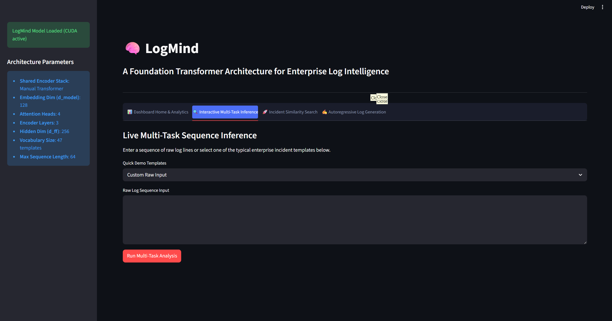

# LogMind: A Custom Multi-Task Transformer for Enterprise Log Intelligence

Building a custom Transformer architecture from scratch for anomaly detection, failure prediction, root cause analysis, next-event prediction, and intelligent log understanding.

---

## 🖥️ Streamlit Interactive UI Dashboard

LogMind includes a complete dashboard to interact with the model locally. Below is the active interface showing multi-task inference, sequence classification, and self-attention mappings:



To launch the dashboard:
```bash
streamlit run app.py
```

---

## 🏗️ Architecture Design & Lifecycles

LogMind structures log intelligence as a two-stage **pretrain-then-finetune** lifecycle, sharing a single Transformer Encoder to extract log sequence representations:

```
========================================================================
STAGE 1: SELF-SUPERVISED PRETRAINING (Representation Learning)
========================================================================
[Raw Logs] -> [LogParser] -> [Tokenizer] -> [MLM / CLM Dataset]
                                                  |
                                                  v
                                    +---------------------------+
                                    | Shared Transformer Encoder|
                                    +---------------------------+
                                                  |
                         +------------------------+------------------------+
                         | (Bidirectional Mask)                            | (Causal Mask)
                         v                                                 v
           +---------------------------+                     +---------------------------+
           |   Masked Token Predictor  |                     |    Next Event Generator   |
           +---------------------------+                     +---------------------------+

========================================================================
STAGE 2: MULTI-TASK SUPERVISED FINE-TUNING (Downstream Operations)
========================================================================
[Pretrained Encoder Weights]
            |
            v
+---------------------------+
| Shared Transformer Encoder|
+---------------------------+
            |
            +-----------> [CLS Pooling] -> Sequence Representation
                                |
         +----------------------+----------------------+
         |                      |                      |
         v                      v                      v
+------------------+   +------------------+   +------------------+
| Anomaly Detector |   |     RCA Head     |   | Contrastive Head |
| (Binary Failure) |   | (6-Class Failure)|   | (L2 Normalized)  |
+------------------+   +------------------+   +------------------+
                                                       |
                                                       v
                                              [Vector Search Index]
```

---

## 🪵 Log Preprocessing & Normalization Pipeline

Raw logs contain volatile parameters (IP addresses, timestamps, ports, memory addresses) that lead to an infinite vocabulary. LogMind uses a regular-expression-based parser to normalize these fields into placeholders, collapsing the log stream into a structured set of event templates.

### 1. Raw Log Structure
HDFS log lines follow the format:
```
081109 203518 143 INFO dfs.DataNode$DataXceiver: Receiving block blk_-1608999687919862906 src: /10.250.19.102:54106 dest: /10.250.19.102:50010
```
* **Date**: `081109` (YYMMDD)
* **Time**: `203518` (HHMMSS)
* **Thread ID**: `143`
* **Log Level**: `INFO`
* **Component**: `dfs.DataNode$DataXceiver`
* **Message**: `Receiving block blk_-1608999687919862906 src: /10.250.19.102:54106 dest: /10.250.19.102:50010`

### 2. Regex Normalization
| Source Pattern | Regex Pattern | Placeholder |
| :--- | :--- | :--- |
| Block ID | `blk_[-]?\d+` | `<block_id>` |
| IP with Port | `/\d{1,3}\.\d{1,3}\.\d{1,3}\.\d{1,3}:\d+` | `<ip>` |
| Standard IP | `\d{1,3}\.\d{1,3}\.\d{1,3}\.\d{1,3}` | `<ip>` |
| Numbers | `\b\d+\b` | `<num>` |
| File Paths | `/[a-zA-Z0-9_\-\./]+` | `<path>` |
| Hex Addresses | `0x[0-9a-fA-F]+` | `<hex>` |

*Example output template:*
`Receiving block <block_id> src: <ip> dest: <ip>`

### 3. Vocabulary & Special Tokens
The tokenizer reserves the first five IDs for special tokens:
* `[PAD]` (ID 0): Pads sequences to a uniform length.
* `[UNK]` (ID 1): Replaces out-of-vocabulary event templates.
* `[CLS]` (ID 2): Prepended to every sequence to aggregate sequence representations.
* `[SEP]` (ID 3): Appended to the end of every sequence.
* `[MASK]` (ID 4): Replaces tokens selected for pretraining masking.

---

## 🧮 Custom Transformer Architecture: First-Principles Math

The entire Transformer stack is custom-implemented in PyTorch without high-level abstractions:

### 1. Token Embeddings & Positional Encodings
The input token IDs are projected to a dense representation:
```math
E = W[X]
```
Where $X$ is the input sequence of token IDs, $E$ is the dense representation, and $W \in \mathbb{R}^{V \times D}$ (with $V$ as vocabulary size and $D$ as model dimension).

We support two modes of positional encodings:
* **Sinusoidal Positional Encodings**: Non-learnable trigonometric coordinates:
  ```math
  PE_{(pos, 2i)} = \sin\left(\frac{pos}{10000^{2i/D}}\right), \quad PE_{(pos, 2i+1)} = \cos\left(\frac{pos}{10000^{2i/D}}\right)
  ```
  where $D$ is the model dimension.
* **Learned Positional Embeddings**: A parameter weight matrix $P \in \mathbb{R}^{S \times D}$ where $S$ is the maximum sequence length.

The final input representation is:
```math
X_0 = \text{Dropout}(E + P)
```

### 2. Multi-Head Self-Attention (MHA)
Inputs are projected to Query ($Q$), Key ($K$), and Value ($V$) matrices using manual parameter multiplications:
```math
Q = X W_q + b_q, \quad K = X W_k + b_k, \quad V = X W_v + b_v
```
Where $W_q, W_k, W_v \in \mathbb{R}^{D \times D}$. These projections are split into $H$ heads of dimension $d = D / H$.

The attention weights are computed using a scaled dot-product:
```math
\text{Attention}(q, k, v) = \text{softmax}\left(\frac{q k^T}{\sqrt{d}} + M\right) v
```
* **Modular Masking Matrix ($M$ value assignment)**:
  * **Bidirectional Masking**: Prevents attention to padding tokens. $M_{i,j} = 0$ for active tokens, and $M_{i,j} = -10^9$ for padding tokens.
  * **Causal Masking**: Enforces autoregressive constraints. $M_{i,j} = 0$ for active tokens where $j \le i$, and $M_{i,j} = -10^9$ for padding tokens or when $j > i$.

### 3. Layer Normalization
Normalizes each sample across the final feature dimension:
```math
\text{LN}(X) = \gamma \odot \left(\frac{X - \mu}{\sqrt{\sigma^2 + \epsilon}}\right) + \beta
```
Where mean ($\mu$) and biased variance ($\sigma^2$) are calculated manually. $\gamma$ and $\beta$ are learnable vectors, and $\epsilon = 10^{-5}$.

### 4. Residual Routing
* **Pre-LN (Default)**: Normalization is applied *before* the sublayer:
  ```math
  X_{out} = X_{in} + \text{Dropout}(\text{Sublayer}(\text{LN}(X_{in})))
  ```
* **Post-LN**: Normalization is applied *after* adding the residual:
  ```math
  X_{out} = \text{LN}(X_{in} + \text{Dropout}(\text{Sublayer}(X_{in})))
  ```

---

## 🎯 Multi-Task Downstream Prediction Heads

### 1. Next Log Event & MLM Head
Projects sequence representations to the vocabulary space to predict token probabilities:
```math
\text{Logits}_{MLM} = H W_{out} + b_{out}
```
Where $H \in \mathbb{R}^{B \times L \times D}$.

### 2. Anomaly Classification (Failure Prediction) Head
Performs sequence classification using a two-layer Multi-Layer Perceptron (MLP) over the `[CLS]` token representation ($h \in \mathbb{R}^{D}$):
```math
h_{int} = \tanh(h W_1 + b_1)
```
```math
\text{Logit}_{anomaly} = h_{int} W_2 + b_2
```

### 3. Root Cause Analysis (RCA) Head
Categorizes sequences into 6 distinct classes:
```math
\text{Logits}_{RCA} = \text{GELU}(h W_a + b_a) W_b + b_b \quad \text{where } \text{Logits}_{RCA} \in \mathbb{R}^6
```

### 4. Contrastive Projection Head
Projects the sequence embedding to a metric space and applies $L_2$ normalization:
```math
z = h W_{proj} + b_{proj} \quad \text{where } z \in \mathbb{R}^{d_{emb}}
```
```math
e = \frac{z}{\|z\|_2}
```

---

## ⚡ Supervised Multi-Task Loss Functions

### 1. Stage 1: Self-Supervised Losses
* **MLM Loss**: Cross-entropy loss over masked positions (unmasked positions are set to $-100$):
  ```math
  L(\text{MLM}) = -\frac{1}{N_{masked}} \sum_{i \in \text{masked}} \log P(x_i = y_i)
  ```
* **CLM Loss**: Shifts targets by 1 step to predict subsequent event templates:
  ```math
  L(\text{CLM}) = -\frac{1}{L-1} \sum_{t=0}^{L-2} \log P(x_{t+1} | x_{\le t})
  ```

### 2. Stage 2: Joint Supervised Fine-Tuning Losses
```math
L(\text{total}) = w_1 L(\text{anomaly}) + w_2 L(\text{RCA}) + w_3 L(\text{contrastive})
```
* **$L(\text{anomaly})$**: Binary Cross-Entropy with Logits.
* **$L(\text{RCA})$**: Multi-class Cross-Entropy.
* **$L(\text{contrastive})$ (Siamese Pairwise Contrastive Loss)**: Evaluates pairwise similarity $s_{i,j} = e_i \cdot e_j$ for a batch of size $B$:
  ```math
  L(\text{contrastive}) = \frac{1}{|P|} \sum_{(i,j) \in P} (1 - s_{i,j}) + \frac{1}{|N|} \sum_{(i,j) \in N} \max(0, s_{i,j} - m)^2
  ```
  * $P$: Positive pairs where labels are identical ($l_i = l_j$).
  * $N$: Negative pairs where labels differ ($l_i \neq l_j$).
  * $m$: Margin parameter (default $0.5$).

---

## 📊 Experimental Results (HDFS LogHub Dataset)

The model was pretrained and fine-tuned on the HDFS LogHub dataset using a 3-layer custom Transformer Encoder on an **NVIDIA GeForce RTX 4070 Laptop GPU**.

### 1. Stage 1: Self-Supervised MLM Pretraining (5 Epochs)
* **Validation Token Accuracy**: **97.15%**
* **Validation Perplexity**: **1.08**

### 2. Stage 2: Supervised Fine-Tuning (10 Epochs)
* **Failure Prediction (Anomaly Classification)**:
  * **Accuracy**: **97.60%**
  * **Precision**: **100.00%** (Zero False Positives)
  * **Recall**: **53.97%**
  * **F1-Score**: **70.10%**
  * **ROC-AUC**: **77.28%**
* **Root Cause Analysis (6-Class Failure Categorization)**:
  * **Accuracy**: **97.60%**
  * **Macro F1-Score**: **72.61%**

---

## 🔍 Observing Model Convergence

The training and evaluation scripts output real visualizations under the `plots/` folder:

1. **Pretraining Loss Curves (`plots/pretraining_curves.png`)**: Shows loss decay and validation token accuracy progression.
2. **Fine-Tuning Performance Curves (`plots/finetuning_curves.png`)**: Charts anomaly detection and RCA Macro F1 scores.
3. **t-SNE Embeddings (`plots/test_embeddings_tsne.png`)**: Displays how contrastive embeddings cluster log sequences by their Root Cause Analysis categories, clearly separating Normal events from Write Failures, Timeouts, and Serving errors.
4. **Anomaly Timeline (`plots/anomaly_timeline.png`)**: Displays predicted anomaly probabilities across a sequential stream of logs.
5. **Attention Heatmap (`plots/sample_attention_heatmap.png`)**: Shows visual attention matrices over specific failure events, illustrating how the self-attention heads focus on exception patterns.

### Real Codebase Visualizations:

| Pretraining curves | Fine-Tuning curves |
| :---: | :---: |
|  |  |

| t-SNE Embeddings | Anomaly Timeline |
| :---: | :---: |
|  |  |

| Attention Map |
| :---: |
|  |

---

## 🚀 Execution Instructions

### 1. Requirements & Setup
Configure your virtual environment and install dependencies:
```bash
# Initialize venv
python -m venv venv
source venv/bin/activate  # On Windows: venv\Scripts\activate

# Install dependencies
pip install torch pandas matplotlib seaborn pyyaml streamlit scikit-learn pytest
```

### 2. Run All Unit Tests
Verify the mathematical correctness of attention weights, layer norm equivalence, MLM masking, and CLM shifting:
```bash
python -m pytest
```

### 3. Run Training & Evaluation Pipeline
```bash
python main.py
```
This script executes the self-supervised pretraining stage, transfers encoder weights, runs multi-task fine-tuning, prints final test metrics, and exports all plots.
