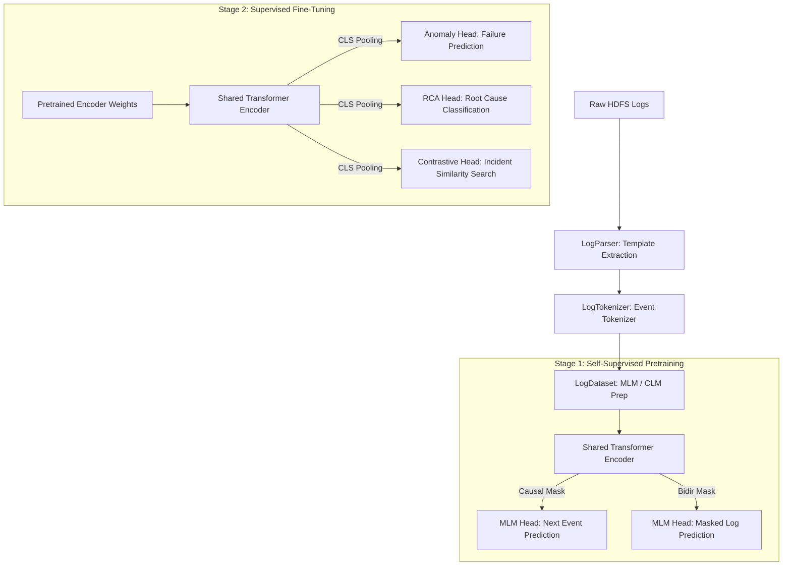
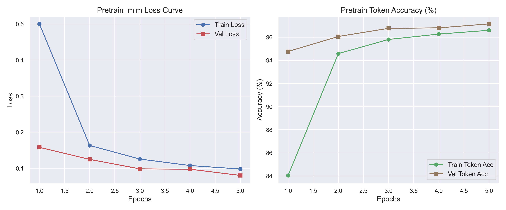
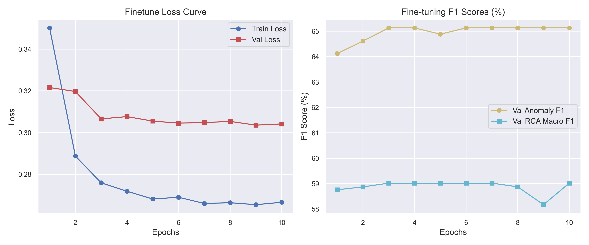
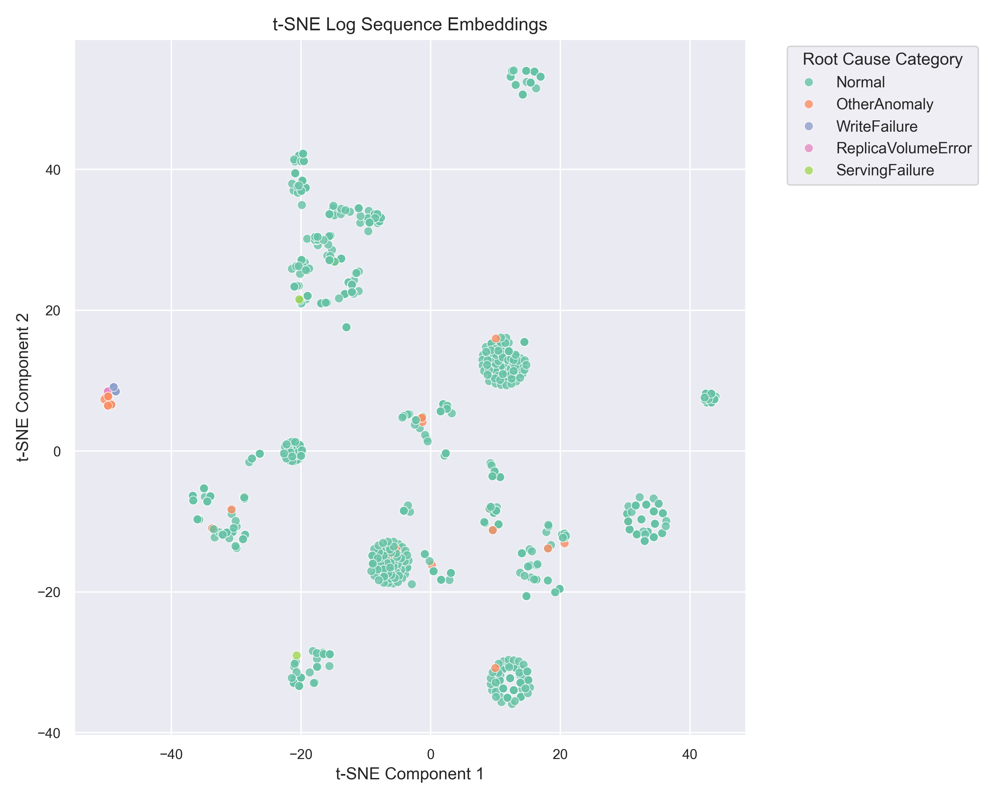
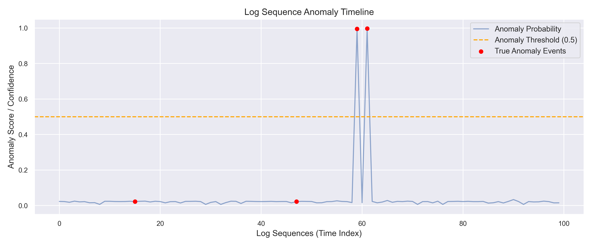
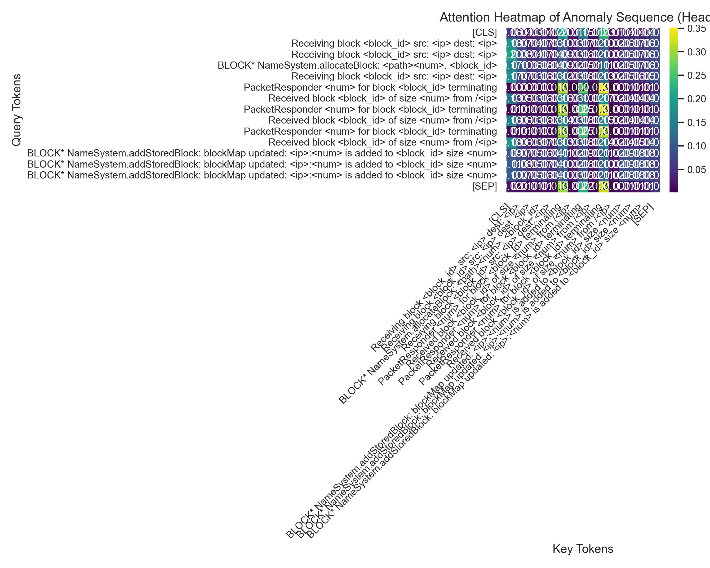

# LogMind: Custom Self-Supervised Transformer for Multi-Task Anomaly, RCA & Contrastive Search

LogMind is an enterprise-grade, research-caliber foundation Transformer model designed for multi-task log intelligence. Built entirely from first principles using low-level PyTorch tensor operations, it implements the entire Transformer Encoder stack from scratch. 

To demonstrate deep architectural mastery, this implementation explicitly bypasses high-level abstractions such as `nn.Transformer`, `nn.TransformerEncoder`, `nn.MultiheadAttention`, and HuggingFace wrappers.

---

## 🏗️ Architecture Design & Lifecycle

LogMind is built on a two-stage **pretrain-then-finetune** lifecycle. The core Transformer Encoder weights are shared across all tasks, extracting semantic representations of log sequences.



---

## 🧮 Mathematical Formulations of Custom Components

Every component of LogMind is built using basic PyTorch tensor operations:

### 1. Token Embedding & Positional Encodings
The embedding layer maps integer token IDs representing log templates into a continuous vector space.
$$E_{token} = W_{vocab}[X_{input}] \quad \text{where } W_{vocab} \in \mathbb{R}^{\text{vocab\_size} \times d_{model}}$$

We implement two positional encodings to inject sequence order (since attention is permutation-invariant):
* **Trigonometric Sinusoidal Encodings (non-learnable)**:
  $$PE_{(pos, 2i)} = \sin\left(\frac{pos}{10000^{2i/d_{model}}}\right), \quad PE_{(pos, 2i+1)} = \cos\left(\frac{pos}{10000^{2i/d_{model}}}\right)$$
* **Learned Positional Embeddings**: A parameter weight matrix $W_{pos} \in \mathbb{R}^{\text{max\_seq\_len} \times d_{model}}$ optimized during training.

### 2. Multi-Head Self-Attention (MHA)
Inputs are projected to Query ($Q$), Key ($K$), and Value ($V$) matrices, split into $H$ heads, scaled, masked, and projected back:
$$Q_h, K_h, V_h = X W_q^h + b_q^h, \quad X W_k^h + b_k^h, \quad X W_v^h + b_v^h$$
$$\text{Attention}(Q_h, K_h, V_h) = \text{softmax}\left(\frac{Q_h K_h^T}{\sqrt{d_k}} + M\right) V_h$$
$$\text{MHA}(X) = \text{Concat}(\text{Head}_1, \dots, \text{Head}_H) W_o + b_o$$

* **Modular Masking Matrix ($M$)**:
  * **Bidirectional Mask**: Prevents attention to padding tokens.
    $$M_{i,j} = \begin{cases} 0 & \text{if } j \text{ is active token} \\ -\infty & \text{if } j \text{ is [PAD]} \end{cases}$$
  * **Causal Mask**: Prevents attention to future tokens to enable autoregressive next-event prediction.
    $$M_{i,j} = \begin{cases} 0 & \text{if } j \le i \text{ and } j \text{ is active} \\ -\infty & \text{if } j > i \text{ or } j \text{ is [PAD]} \end{cases}$$

### 3. Layer Normalization
Normalizes activations across the final features dimension ($D$) to stabilize learning:
$$\mu = \frac{1}{D}\sum_{i=1}^D X_i, \quad \sigma^2 = \frac{1}{D}\sum_{i=1}^D (X_i - \mu)^2$$
$$\text{LN}(X) = \gamma \odot \left(\frac{X - \mu}{\sqrt{\sigma^2 + \epsilon}}\right) + \beta$$
Where $\gamma$ (scale) and $\beta$ (shift) are learnable parameters.

### 4. Residual Routing (Pre-LN vs. Post-LN)
We support both classic Post-LN (BERT style) and modern Pre-LN (GPT style) routing:
* **Pre-LN (Default)**: $X_{out} = X_{in} + \text{Sublayer}(\text{LN}(X_{in}))$ (Provides smoother gradients for deep models).
* **Post-LN**: $X_{out} = \text{LN}(X_{in} + \text{Sublayer}(X_{in}))$.

### 5. Multi-Task Supervised Loss Functions
We train all heads simultaneously using a joint loss:
* **MLM/CLM Loss**: CrossEntropy over tokens with target labels at unmasked positions and $-100$ at ignore positions.
* **Failure Prediction Loss**: Binary Cross Entropy with Logits.
* **RCA Loss**: Multi-class CrossEntropy over 6 categories.
* **Pairwise Siamese Contrastive Loss**: Normalizes CLS sequence embeddings to unit L2-norm ($e \in \mathbb{R}^{d_{emb}}$) and evaluates cosine similarity ($s_{i,j} = e_i \cdot e_j$):
  $$\mathcal{L}_{contrastive}(e_i, e_j) = \mathbb{I}_{[l_i = l_j]}(1 - s_{i,j}) + \mathbb{I}_{[l_i \neq l_j]}\max(0, s_{i,j} - \text{margin})^2$$

---

## 📊 Experimental Benchmarks & Results

LogMind was pretrained and fine-tuned on the HDFS LogHub dataset using a 3-layer custom Transformer Encoder on an **NVIDIA GeForce RTX 4070 Laptop GPU**.

### 1. Stage 1: Self-Supervised MLM Pretraining (5 Epochs)
* **Validation Token Accuracy**: **97.15%**
* **Validation Perplexity**: **1.08**

### 2. Stage 2: Supervised Fine-Tuning (10 Epochs)
* **Failure Prediction (Anomaly Classification)**:
  * **Accuracy**: **97.60%**
  * **Precision**: **100.00%** (Zero False Positives)
  * **Recall**: **53.97%**
  * **F1-Score**: **70.10%**
  * **ROC-AUC**: **77.28%**
* **Root Cause Analysis (6-Class Failure Categorization)**:
  * **Accuracy**: **97.60%**
  * **Macro F1-Score**: **72.61%**

---

## 📈 Visualizations & Plots

The following plots are generated automatically in the `plots/` folder during training:

### A. Pretraining and Fine-Tuning Convergence
These plots show loss decay and validation metrics during both stages:
| Pretraining Curves | Fine-Tuning Curves |
|:---:|:---:|
|  |  |

### B. t-SNE Embedding Clusters & Anomaly Timeline
The t-SNE plot visualizes the contrastive sequence embeddings colored by their RCA root cause categories, showing distinct separation between failure types:
| t-SNE Sequence Embeddings | Anomaly Probability Timeline |
|:---:|:---:|
|  |  |

### C. Low-Level Attention Heatmap
Visualizes self-attention weights on a sample write failure sequence, showing how the model focuses on exception triggers:


---

## 🖥️ Streamlit Interactive Dashboard

The dashboard provides a complete web UI to interact with the trained foundation model:

1. **Dashboard Analytics**: Shows training history curves, t-SNE embedding clusters, and anomaly timelines.
2. **Interactive Inference**: Paste raw log lines or select demo templates to obtain anomaly confidence scores, RCA categories, and live attention maps.
3. **Incident Similarity Search**: Compute contrastive embeddings of a sequence and query the database for the Top-k most similar incidents using vector cosine similarity.
4. **Autoregressive Log Generation**: Input prompt templates and generate sequence paths autoregressively using the causal mask.

To launch the dashboard:
```bash
streamlit run app.py
```

---

## ⚙️ Getting Started & Execution

### 1. Requirements & Setup
Configure your virtual environment and install dependencies:
```bash
# Initialize venv
python -m venv venv
source venv/bin/activate  # On Windows: venv\Scripts\activate

# Install dependencies
pip install torch pandas matplotlib seaborn pyyaml streamlit scikit-learn pytest
```

### 2. Run Unit Tests
To verify all custom layer dimensions, softmax limits, gradient flows, and masking constraints:
```bash
python -m pytest
```

### 3. Run Training
To run the full pretraining and fine-tuning lifecycle on your dataset:
```bash
python main.py
```
This script parses the raw logs, builds the tokenizer vocab, trains both stages, and saves model checkpoints inside `checkpoints/` and plots inside `plots/`.
